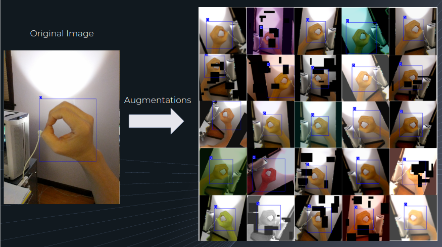
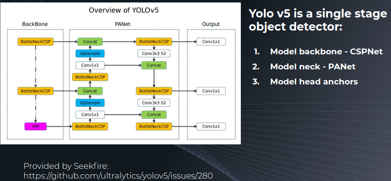

### GA_Data_Science_Capstone_Project
# Interactive ABC's with American Sign Language
### A step in Increasing Accessability for the Deaf Community with Computer Vision utilizing Yolov5.

# Executive Summary
Utilizing Yolov5, a custom computer vision model was created on the American Sign Language alphabet.  The project was promoted on social platforms to diversify the dataset. A total of 721 images were collected in the span of two weeks using DropBox request forms.  Manual labels were created of the original images which were then resized, and organized for preprocessing. Several carefully selected augmentations were made to the images to compensate for the small dataset count.  A total of 18,000 images were then used for modeling.  Transfer learning was incorporated with Yolov5m weights and training completed on 300 epochs with an image size of 1024 in 163 hours. A mean average precision score of 0.8527 was achieved.  Inference tests were successfully performed with areas identifying the models strengths and weaknesses for future development.  

All operations were performed on my local Linux machine with a CUDA/cudNN setup using Pytorch.

# Problem Statement:
Have you ever considered how easy it is to perform simple communication tasks such as ordering food at a drive thru, discussing financial information with a banker, telling a physician your symptoms at a hospital, or even negotiating your wages from your employer?  What if there was a rule where you couldn’t speak and were only able to use your hands for each of these circumstances? The deaf community cannot do what most of the population take for granted and are often placed in degrading situations due to these challenges they face every day. Access to qualified interpretation services isn’t feasible in most cases leaving many in the deaf community with underemployment, social isolation, and public health challenges. To give these members of our community a greater voice, I have attempted to answer this question:

**Can computer vision bridge the gap for the deaf and hard of hearing by learning American Sign Language?**

In order to do this, a Yolov5 model was trained on the ASL alphabet.  If successful, it may mark a step in the right direction for both greater accessibility and educational resources.

# Data Collection Method:
The decision was made to create an original dataset for a few reasons.  The first was to mirror the intended environment on a mobile device or webcam.  These often have resolutions of 720 or 1080p. Several existing datasets have a low resolution and many do not include the letters “j” and “z” as they require movements.

A letter request form was created with an introduction to my project along with instruction on how to submit voluntary sign language images with dropbox file request forms.  This was distributed on social platforms to bring awareness, and to collect data.

    
#### Dropbox request form used: (Deadline Sep. 27th, 2020)
https://docs.google.com/document/d/1ChZPPr1dsHtgNqQ55a0FMngJj8PJbGgArm8xsiNYlRQ/edit?usp=sharing
[link](https://docs.google.com/document/d/1ChZPPr1dsHtgNqQ55a0FMngJj8PJbGgArm8xsiNYlRQ/edit?usp=sharing)
    
A total of 720 images were collected:

Here is the distributions of images: (Letters / Counts)

A - 29  
B - 25  
C - 25  
D - 28  
E - 25  
F - 30  
G - 30  
H - 29  
I - 30  
J - 38  
K - 27  
L - 28  
M - 28  
N - 27  
O - 28  
P - 25  
Q - 26  
R - 25  
S - 30  
T - 25  
U - 25  
V - 28  
W - 27  
X - 26  
Y - 26  
Z - 30  

# Preproccessing
### Labeling the images
Manual bounding box labels were created on the original images using the labelImg software.

Each of the pictures and bounding box coordinates were then passed through an albumentations pipeline that resized the images to 1024 x 1024 pixel squares and added probabilities of different transformations.

These transformations included specified degrees of rotations, shifts in the image locations, blurs, horizontal flips, random erase, and a variety of other color transformations.  
  

25 augmented images were created for each image resulting in an image set of 18,000 used for modeling.

# Modeling: Yolov5
To address acceptable inference speeds and size, Yolov5 was chosen for modeling. 

This was released in June 10th of this year, and is still in active development.  Although Yolov5 by Ultralytics is not created by the original Yolo authors, Yolo v5 is said to be faster and more lightweight, with accuracy on par with Yolo v4 which is widely considered as the fastest and most accurate real-time object detection model.

Yolo was designed as a convolutional neural network for real time object detection.  Its more complex than basic classification as object detection needs to identify the objects and locate where it is on the image. This single stage object detector, has 3 main components:

The backbone basically extracts important features of an image,  the neck mainly uses feature pyramids which help in generalizing the object scaling for better performance on unseen data.  The model head does the actual detection part where anchor boxes are applied on features that generate output vectors.
These vectors include the class probabilities, the objectness scores, and bounding boxes.

The model used was yolov5m with transfer learning on pretrained weights.

